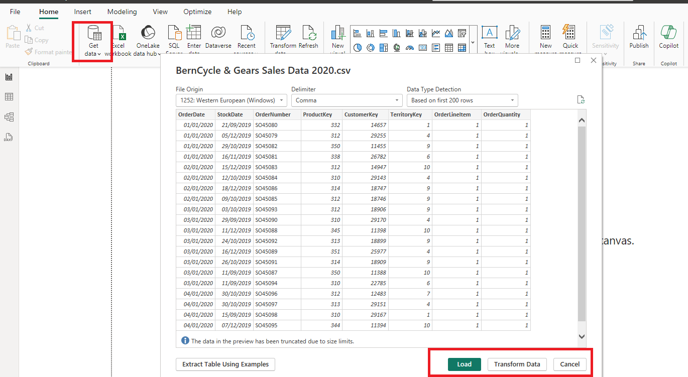
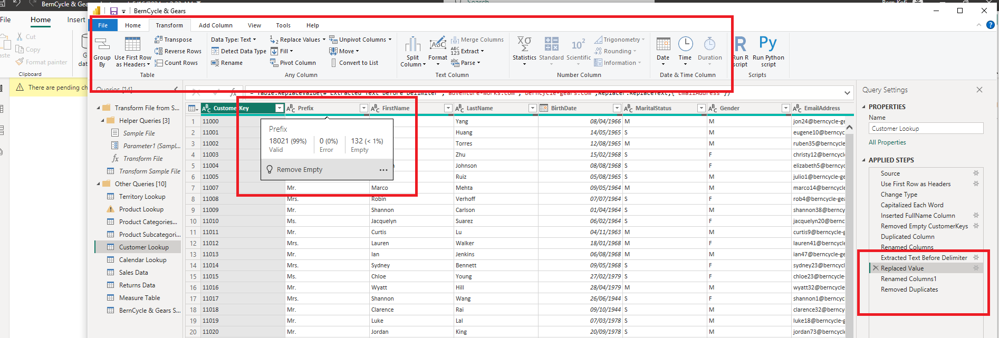
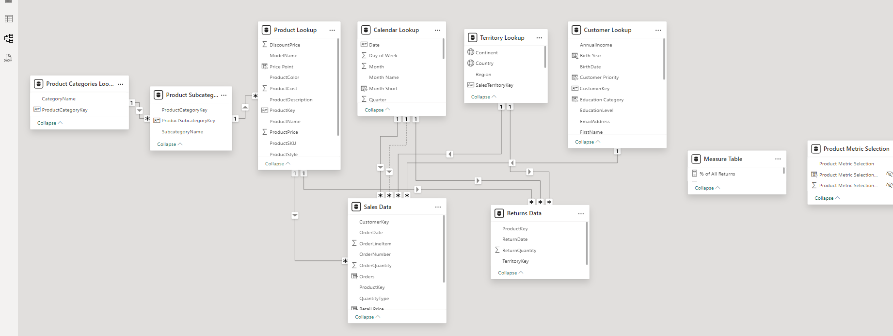
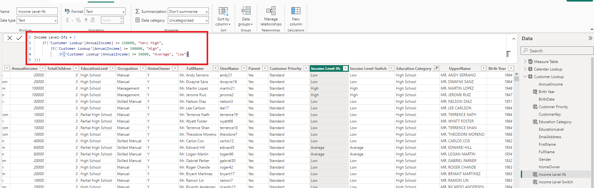
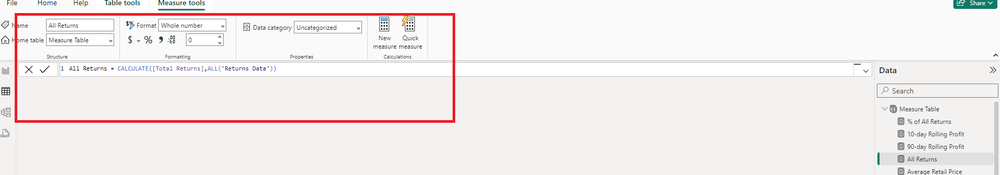
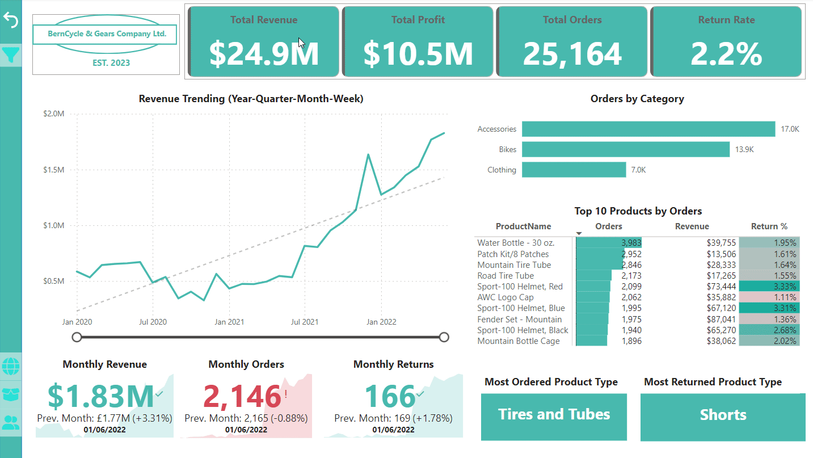

# BIKING ACCESSORIES ANALYSIS
## by BEKO
**Date last Updated: 2nd Feb. 2024**

## PROJECT SUMMARY
Being an e-commerce project, this study aims to track the sales and revenue patterns of biking equipment and accessories, alongside, customer trends in 6 countries: The United States, Canada, Australia, France, Germany and the United Kingdom. Following the March 2020 COVID-19 pandemic, millions of people worldwide looked for alternate methods to move around and stay active when gyms shut down and public transportation became unsafe. In the U.S., consumer spending on bicycles and accessories peaked in 2021, according to adjusted figures from the *U.S. Bureau of Economic Analysis*. 

Datasets were obtained from **[Kaggle](https://www.kaggle.com/datasets/algorismus/adventure-works-in-excel-tables/data)**. Sales and return data are available for the period between 01/01/2020 and 30/06/2022. 

## Key Steps
`Data Preparation` - Files were downloaded in CSV format. I then duplicated all these files and began preparing my data in Microsoft Excel. To develop key insights from my analysis, I came up with some key business questions. 
- Which biking accessories generate the most revenue?
- What is the revenue trend over different time periods (monthly, quarterly, annually)?
- Who are the top customers based on total revenue generated?
- Which customer segments contribute the most to profits?
- What is the demographic profile of the customer base (age, gender, location)?
- Are there any patterns in order times (day of the week, time of day)?
- What is the profit trend over different time periods?
- How do returns and refunds affect profits?

`Querying and transforming raw data` - I imported the CSV files directly into Power BI using the 'Get Data' option. After the CSV files were loaded or transformed, Power BI platform reads each file as Tables in the column and row structure. I always transformed the data to make the data-cleaning process easier before loading the datasets. 

 

`Data Cleaning` - Most of my data cleaning process was done in Power Query Editor. From the image below, after assessing the quality of my datasets, I noticed some tables had empty and duplicated rows. I removed these rows and other columns that were not necessary for analysis. There were also instances of wrong data types in most cases. In the case of the Annual Income of customers, I converted the values from text to whole number data type. Also, the pre-loaded tables used the US date format. To get used to the data, I modified this to my default date which was in the UK format.

`Data Modeling` - 

`Calculated Columns and DAX Measures` - 

`Building Interactive Dashboard` - 

## Key Features

- Track key performance indicators (KPIs) related to sales, revenue, profit, and returns.
- Compare performance across different countries.
- Analyse product-level trends.
- Identify high-value customers.

