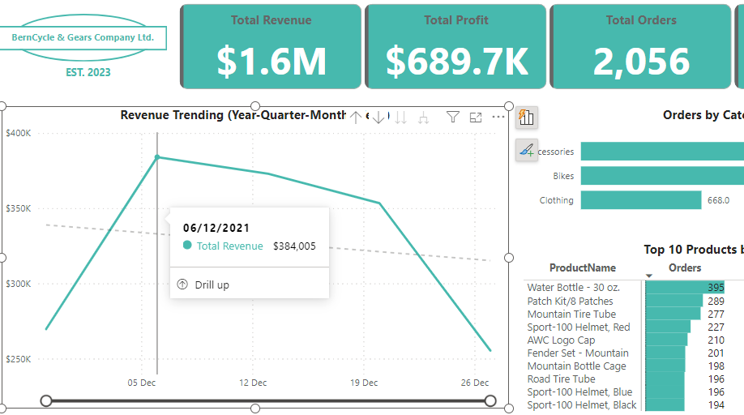
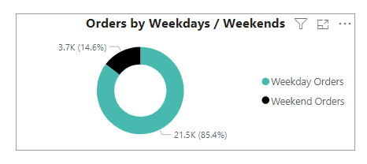
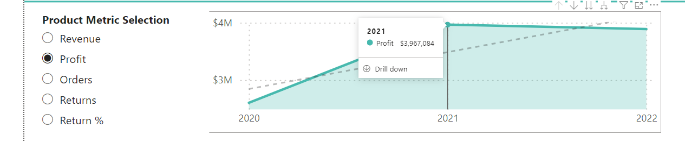
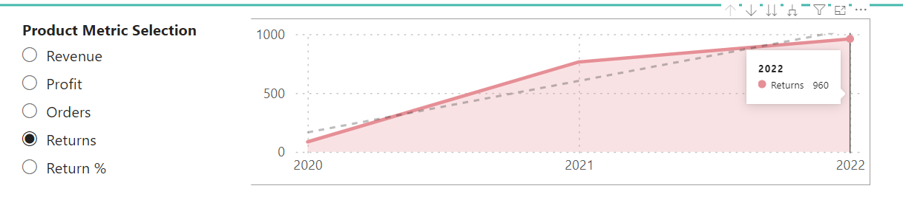

# BIKING ACCESSORIES ANALYSIS
## by BEKO
**Date last Updated: 2nd Feb. 2024**

## PROJECT SUMMARY
Being an e-commerce project, this study aims to track the sales and revenue patterns of biking equipment and accessories, alongside, customer trends in 6 countries: The United States, Canada, Australia, France, Germany and the United Kingdom. Following the March 2020 COVID-19 pandemic, millions of people worldwide looked for alternate methods to move around and stay active when gyms shut down and public transportation became unsafe. In the U.S., consumer spending on bicycles and accessories peaked in 2021, according to adjusted figures from the *U.S. Bureau of Economic Analysis*. 

Datasets were obtained from **[Kaggle](https://www.kaggle.com/datasets/algorismus/adventure-works-in-excel-tables/data)**. Sales and return data are available for the period between 01/01/2020 and 30/06/2022. 

## Key Steps
`Data Preparation` - Files were downloaded in CSV format. I then duplicated all these files and began preparing my data in Microsoft Excel. To develop key insights from my analysis, I came up with some critical business questions. 
- Which biking equipment generate the most revenue?
- What is the revenue trend over different time periods (monthly, quarterly, annually)?
- Which geographic territory of the customer base made the most orders and revenue?
- Who are the top customers based on orders, revenue, occupation and income level?
- Are there any patterns in order times (day of the week, time of day)?
- What is the profit trend over different time periods?
- How do returns affect profits?

`Querying and transforming raw data` - I imported the CSV files directly into Power BI using the 'Get Data' option. After the CSV files were loaded or transformed, Power BI platform reads each file as Tables in the column and row structure. I always transformed the data to make the data-cleaning process easier before loading the datasets. 

 

`Data Cleaning` - A large part of my data cleaning process was done in Power Query. From the image below, after assessing the quality of my datasets, I noticed some tables had empty and duplicated rows. I removed these rows and other columns that were not necessary for analysis. There were also instances of wrong data types in most cases. In the case of the Annual Income of customers, I converted the values from text to whole number data type. Also, the pre-loaded tables used the US date format. To familiarize myself with the time periods of the datasets, I modified this to my default date which was in the UK format.

`Data Modeling` - After the cleaning and transformation process, I created relationships among the 8 tables loaded into Power BI. These tables were grouped into 2 Fact tables (Sales & Return Data) and the other 6 were Dimension/Lookup tables. To create these table relationships, I established primary and foreign keys for all the tables for modeling. I used the Snowflake model schema for my data modeling since there were 2 Fact tables and multiple sub-dimension tables. 

`DAX - Calculated Columns and Measures` - I applied DAX formula for both my Calculated Columns and Measures. 

I used the Calculated Columns for new columns that required filtering. From the screenshot below, I wrote a simple DAX code to filter my customers based on their annual income. This was to provide insights into the purchasing behaviors and preferences of 'High', 'Average' and 'Low' income customers. 

For columns that needed aggregating, I used DAX Measures. Metrics like Total Profits, Revenue, Return Rate were all calculated with DAX measures which are not seen in the tables but only when creating visuals. Calculated Columns, on the other hand, are visible in tables and data view.

# Building Interactive Dashboards

## Key Features

- Track key performance indicators (KPIs) related to sales, revenue, profit, and returns.
- Compare performance across different countries.
- Analyse product-level trends.
- Identify high-value customers.

# INSIGHTS

1. The main categories of Biking equipment were Bikes, Components, Clothing and Accessories. The Bikes product category generated the most revenue and was also the most profitable. However, most orders were placed in the Accessories product category.

2. Approximately $24.9 million in revenue and $10.5 million in profit was generated between 01/01/2020 and 30/06/2022. However, there is a significant dip in revenue between 01/06/2020 and 01/11/2020 (possibly due to the simulated impact of the COVID-19 pandemic), after which revenue appears to grow linearly. In the first week of December 2021, revenue saw an exceptional increase, reaching $1.64 million. This was due to a highly successful seasonal campaign, most likely a Black Friday promotion or a Christmas promotion? 

 

3. The USA had 8,700 orders placed while France (2,315 orders) had the least. However, based on revenue, the USA generated $7.94 million while Canada generated the least about $1.77 million.

4. Mr. Maurice Shan was the top customer for BernCycle Gears Company in terms of revenue earned($12,408). Based on the most orders placed, there were 5 top customers, each with 26 orders. Customers in the Professional occupation sector put in the most orders(7,925). Customers with average income (between $50k and $100k) also put in significant orders(11,600).

5. 85.4% of the total orders were placed on Weekdays, and the remaining 14.6% were placed on Weekends. The reason for this purchasing behavior by customers might be due to shipping and delivery times. Orders placed during the weekdays are processed and shipped faster as most customers will prefer faster delivery.

6. Profits for BernCycle Gears Company peaked in 2021 ($3.97 million). There was a significant 52.48% profit increase from the previous year.

   
7. In 2022, we saw an all-time high returns value at 960. This indicates that in 2022, profits decreased by 2.02% compared to 2021, the year in which we achieved our highest profit levels. When a biking accessory or product is returned and a refund is issued, the company loses the revenue from that sale. This directly reduces the profits and revenue.

# RECOMMENDATIONS

Based on my insights, I would recommend that BernCycle & Gears Company:

1. Focus on replicating the profitable US & Australian marketing strategies in the least revenue-generating countries (Canada, Germany, France and the UK)

2. Take a closer look on mitigating the higher return rates of cycling equipment and accessories. First step will be providing detailed and accurate product descriptions and images to ensure customers have realistic expectations, so as to reduce the return rates.

3. Introduce reward points for top-performing customers based on the main metrics such as total Orders and Revenue. This will most likely encourage low-performing customers in other categories to place in more orders.

4. Increase production and marketing of top revenue-generating product categories and sub-categories. Bikes specifically mountain bikes could be paired with other accessories as bundle offers to mazimize sales and profits.
    
